# Microsoft Entra ID — Hybrid Identity & Privileged Access Management Lab

*Hybrid Sync • Conditional Access • PIM (JIT) • RBAC • Identity Protection*

**Prepared by:** Abdillahi Hajiali
IT Specialist | Cybersecurity Portfolio Project
Perth, Western Australia
GitHub: [DaBoss8723](https://github.com/DaBoss8723)

---

## 1. Executive Summary

This lab extends an existing on-premises Active Directory homelab (`homelab.local`) into Microsoft Entra ID, Microsoft's cloud identity platform, to build and document a realistic hybrid identity and privileged access management (PAM) environment. The project simulates the identity and access management (IAM) work performed by IAM engineers and SOC analysts in modern enterprises that run both on-premises AD and a cloud identity provider side by side.

The lab covers four pillars of identity security: hybrid synchronization (on-prem to cloud), conditional access (risk-based access control), privileged identity management (just-in-time administrative elevation), and identity monitoring (sign-in and audit log analysis). Every phase is built entirely on free tiers: Microsoft Entra ID Free, and a 30-day Microsoft Entra ID P2 trial for the premium governance features.

### Objectives

- Synchronize an on-premises Active Directory to Microsoft Entra ID using Entra Connect Sync.
- Enforce Conditional Access policies that require MFA and block legacy authentication protocols.
- Implement Privileged Identity Management (PIM) so admin roles are activated just-in-time instead of standing permanently.
- Design least-privilege RBAC using built-in Entra roles, backed by periodic access reviews.
- Monitor and interpret sign-in logs, audit logs, and Identity Protection risk detections.

---

## 2. Skills Demonstrated

| Domain | Skills |
|---|---|
| Identity & Access Management | Hybrid identity sync, RBAC design, least privilege, access reviews |
| Privileged Access Management | Just-in-time elevation, PIM role activation, approval workflows |
| Zero Trust / Conditional Access | Risk-based conditional access, MFA enforcement, legacy auth blocking |
| Detection & Monitoring | Sign-in log triage, audit log analysis, Identity Protection risk events |
| Cloud Administration | Microsoft Entra ID tenant administration, Entra Connect Sync |

---

## 3. Lab Architecture

This lab builds on top of the existing homelab Active Directory environment (VirtualBox internal network `192.168.100.0/24`) rather than replacing it. DC1 (`homelab.local`, `192.168.100.10`) acts as the on-premises identity source, synchronized to a new Microsoft Entra ID tenant in the cloud.

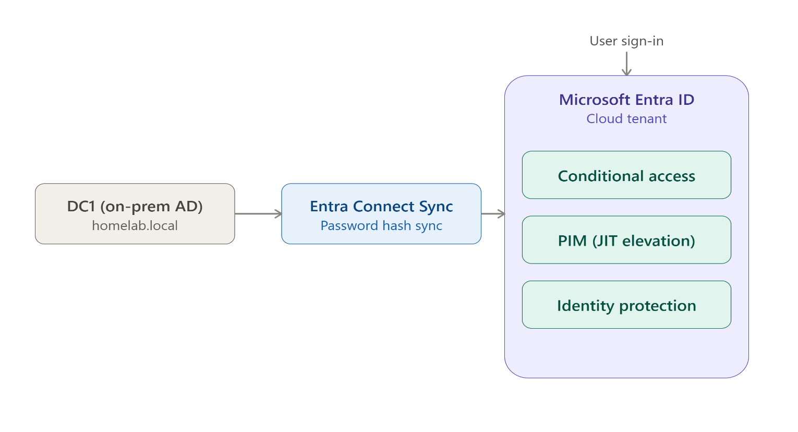

| Component | Role | Location |
|---|---|---|
| DC1 (homelab.local) | On-prem Active Directory source | 192.168.100.10 (existing VM) |
| Entra Connect Sync | Syncs AD objects to the cloud (password hash sync) | Installed on DC1 or a lightweight new VM |
| Microsoft Entra ID tenant | Cloud identity provider | Azure cloud (`yourtenant.onmicrosoft.com`) |
| Test user / admin accounts | Simulate a standard user and an IT admin | Created in on-prem AD, synced to cloud |
| Conditional Access / PIM / Identity Protection | Access control, JIT elevation, risk detection | Microsoft Entra ID (cloud, P2 trial) |

---

## 4. Environment & Tools

- Existing homelab AD: DC1 (Windows Server 2019, `homelab.local`)
- Microsoft account (personal or work) to create the free Azure tenant
- Microsoft Entra Connect Sync (free download from Microsoft)
- Microsoft Entra ID Free tier (included with every Azure/Microsoft 365 signup)
- Microsoft Entra ID P2 free trial (30 days) — unlocks Conditional Access, PIM, Identity Protection
- A web browser for the Entra admin center (entra.microsoft.com)

No paid Azure compute was required for this lab. The only real constraint was the free 30-day P2 trial clock, so Phases 4–6 were completed and evidenced within that window.

---

## 5. Prerequisites & Tenant Setup

A free Microsoft Entra ID tenant was created and given a unique `.onmicrosoft.com` domain name. Identity verification during signup required a card for verification purposes only, with no charge incurred. The screenshot below confirms the new tenant in the Entra admin center, with the tenant ID and primary domain redacted for publication.

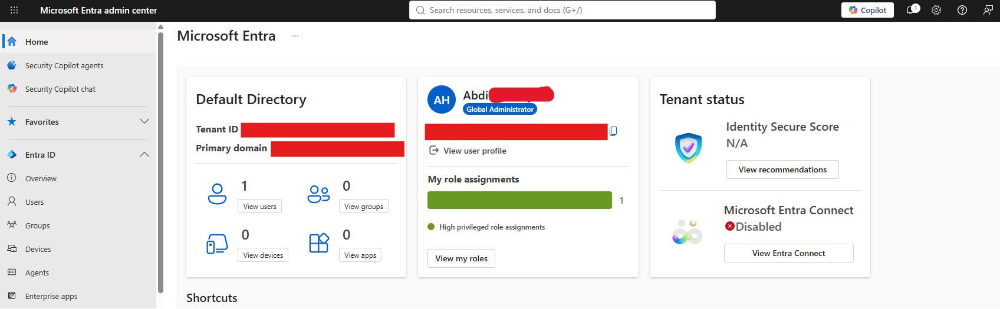

With the tenant created, a 30-day Microsoft Entra ID P2 trial was activated from the Licenses page. This trial is what unlocks Conditional Access, PIM, and Identity Protection — none of which are available on Entra ID Free — and is the ticking clock that shaped the pacing of Phases 2 through 6.

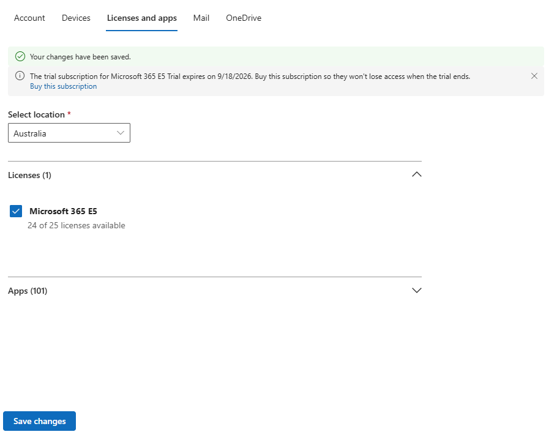

---

## 6. Phase 1 — Hybrid Identity Synchronization

This phase connects the existing on-prem `homelab.local` AD to the new Entra ID tenant so on-prem users and groups appear in the cloud directory, rather than needing separate cloud-only accounts.

### 6.1 Entra Connect Sync setup

Microsoft Entra Connect Sync was installed with a **Custom installation**, selecting **Password Hash Synchronization (PHS)** as the sign-in method — the simplest and most common hybrid sign-in approach for a lab environment, avoiding the added complexity of Pass-through Authentication or ADFS. The sync engine was connected to the tenant using a Global Administrator account, scoped to the `homelab.local` forest and the specific OUs containing lab user accounts (deliberately excluding built-in/system accounts from the sync scope).

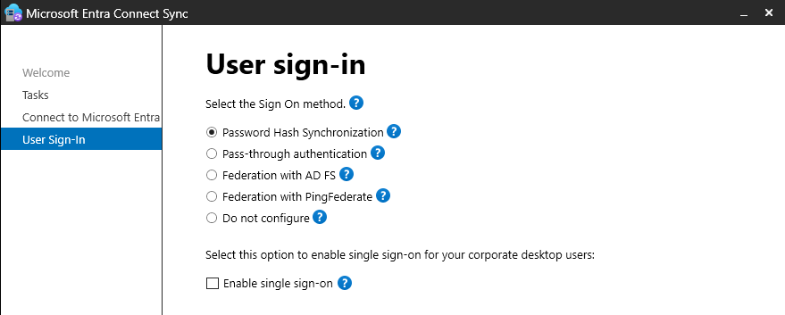

After the wizard completed, the sync service was verified from PowerShell on DC1, confirming the `ADSync` service was running and an initial sync cycle had completed successfully.

```powershell
Get-Service -Name ADSync
Start-ADSyncSyncCycle -PolicyType Initial
```

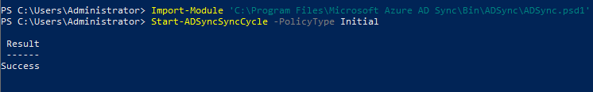

### 6.2 Verifying synchronization in the cloud

Once the sync cycle finished, the Entra admin center's Users list confirmed the on-prem accounts now appeared in the cloud directory, with their **Source** correctly showing as *Windows Server AD* rather than a cloud-only identity — proof that the hybrid link was working as intended.

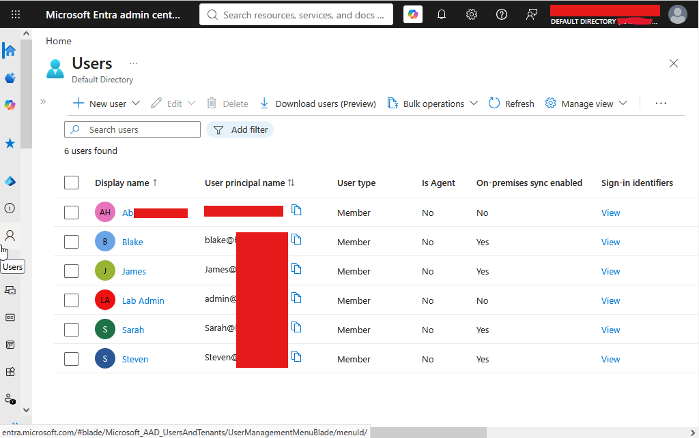

---

## 7. Phase 2 — Conditional Access Policies

With P2 licensing active, this phase moves access control beyond passwords alone, using Conditional Access to enforce risk- and condition-based rules.

### Policy 1: Require MFA for all users

`CA01-Require-MFA-AllUsers` requires multifactor authentication for all users across all cloud apps. All users were included, with a break-glass emergency admin account deliberately excluded — a standard safeguard so a misconfiguration can't lock every admin out simultaneously. The policy was deployed in **Report-only** mode first, so its real-world impact could be reviewed against sign-in logs before it was switched to actively enforcing. The screenshot below shows the finished policy: Report-only state, all users included with one exclusion, all cloud apps in scope, and the MFA grant control configured.

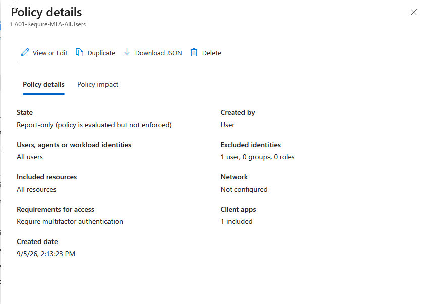

### Policy 2: Block legacy authentication

`CA02-Block-Legacy-Auth` closes a common gap that MFA alone doesn't cover: legacy authentication protocols (like Exchange ActiveSync and other older clients) that can't perform a modern MFA challenge and are frequently targeted in credential-stuffing attacks. This policy targets those client types specifically and blocks access outright rather than granting it conditionally. Its effect was validated using the Conditional Access **What If** tool, simulating a legacy client sign-in and confirming the policy would apply and block it.

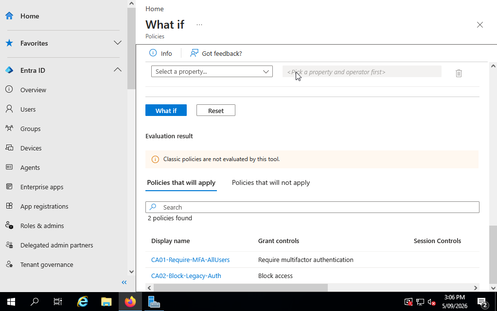

### Policy 3 (stretch): Location-based restriction

As a stretch goal, `CA03-Block-Outside-Trusted-Location` restricts sign-ins to a defined "trusted" network — in this case, the home lab's public IP, registered as a Named location. Any sign-in from outside that IP range is blocked. The named location configuration is shown below (with the IP itself redacted before publishing), followed by a What If simulation confirming a sign-in from an external IP is correctly blocked by the policy.

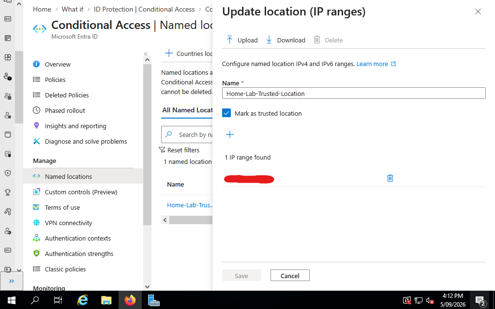

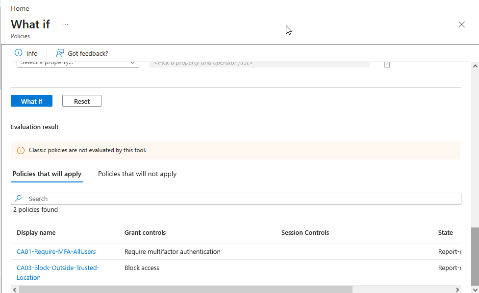

---

## 8. Phase 3 — MFA Registration & Verification

With CA01 in place, a synced test user (not the admin account) registered for MFA using the Microsoft Authenticator app, confirming the account now had a working second factor tied to it.

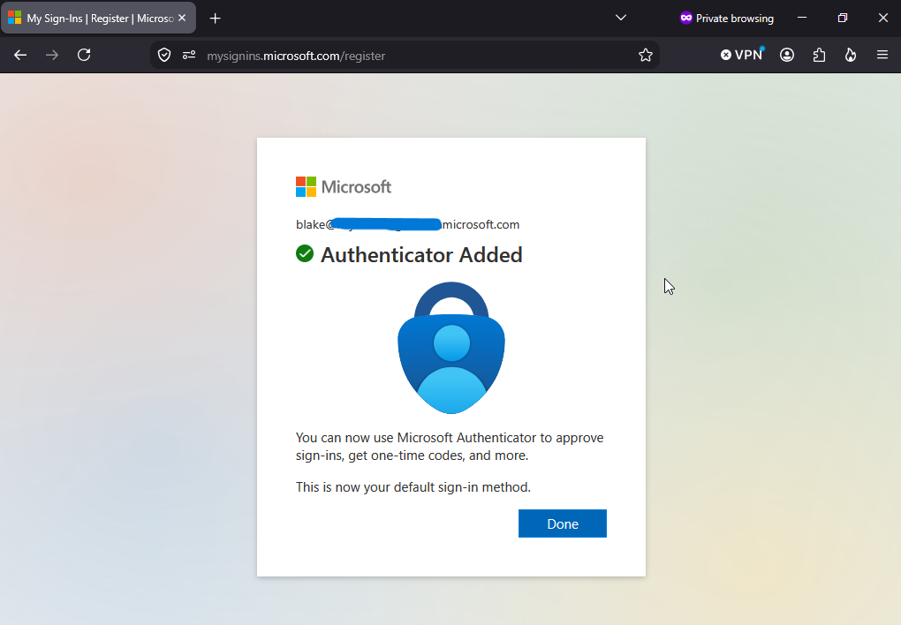

To prove the policy was actually being enforced — not just configured — the same user then signed in from a fresh, unfamiliar browser session. This triggered a live MFA challenge requiring approval through Authenticator, demonstrating that CA01 was actively gating access rather than sitting inert in Report-only mode.

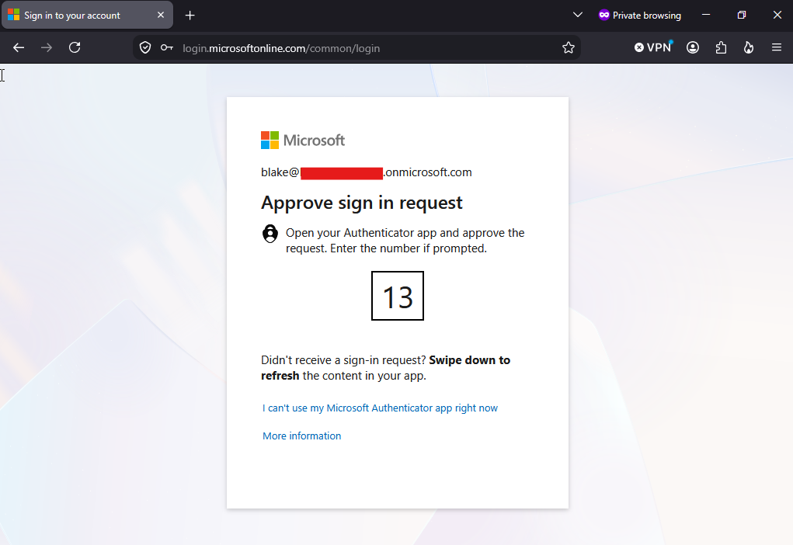

---

## 9. Phase 4 — Privileged Identity Management (Just-in-Time Access)

Standing administrative access is one of the most common findings in real IAM/PAM audits. This phase replaces an always-on admin role with Privileged Identity Management (PIM), so a test admin only holds User Administrator rights for a limited, justified window rather than permanently.

The test admin account was configured as **Eligible** (not Active) for the User Administrator role, with a maximum activation window and a justification requirement set at the role level. The distinction matters: eligibility on its own grants no standing access at all — it only grants the *ability* to request access later.

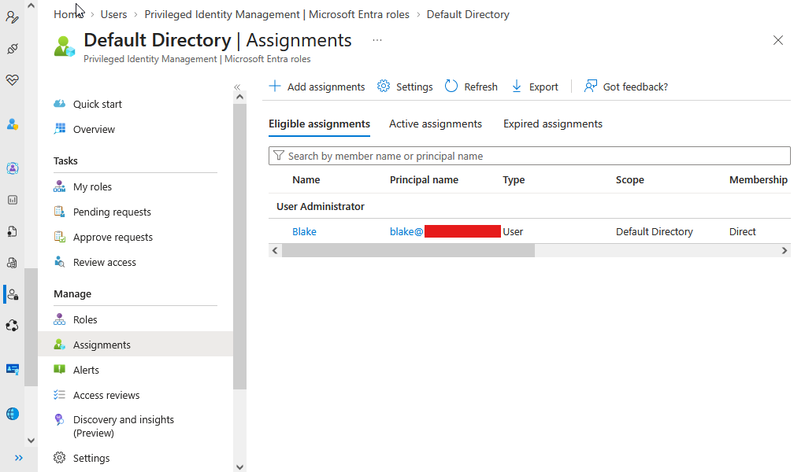

To actually use the role, the test admin signed in separately and activated it through PIM's "My roles" view, entering a justification for the elevation and requesting a short activation window (30 minutes, for a fast test cycle rather than the full 8-hour maximum).

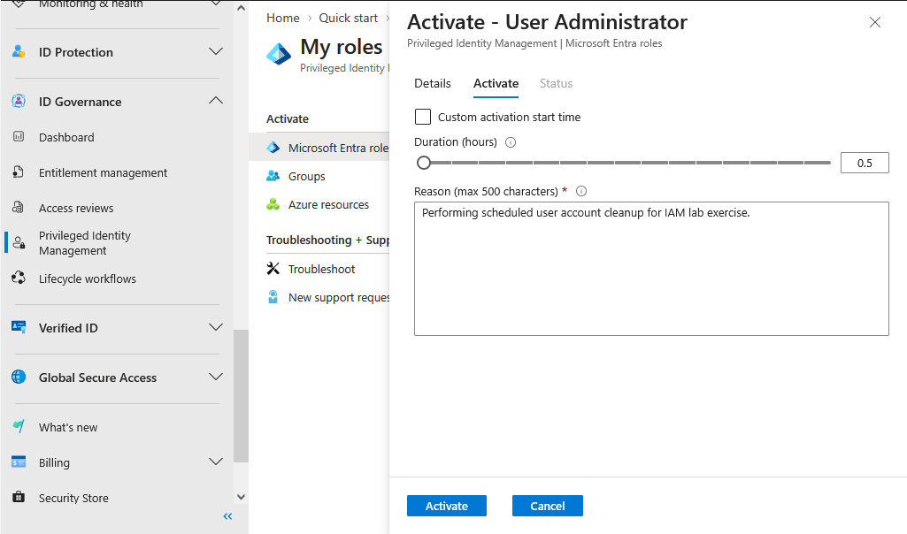

The PIM audit trail below shows the full lifecycle of this access: the initial eligible assignment being granted, the role settings being configured, and finally the role being deactivated — demonstrating that privileged access here is genuinely time-bound rather than a standing grant with no lifecycle.

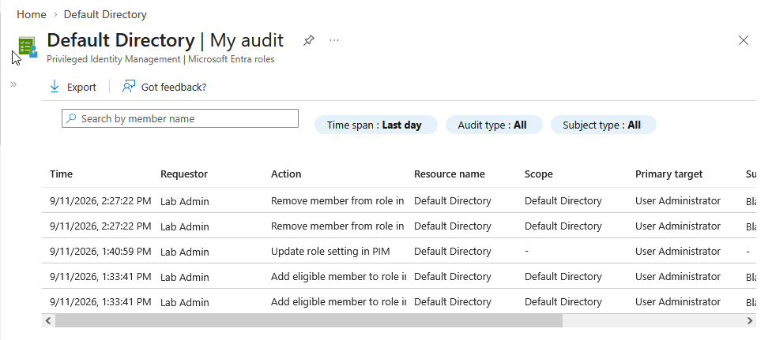

This directly demonstrates just-in-time (JIT) privileged access — the cloud equivalent of the PAM/JIT elevation project area, and a meaningful differentiator for IAM-focused roles.

---

## 10. Phase 5 — Least-Privilege RBAC & Access Reviews

### 10.1 Least-privilege role assignments

Rather than giving every admin-adjacent task Global Administrator rights, each test account was scoped to the narrowest built-in role that fit its actual job. A helpdesk-style account was given the standing **Helpdesk Administrator** role for routine password resets — a low blast-radius role suited to frequent daily use — while broader User Administrator access was made eligible-only through PIM, and only the designated break-glass account retained standing Global Administrator rights (with that account excluded from the Conditional Access policies above, per Microsoft's own recommended practice).

#### RBAC Matrix

| Account | Role Assigned | Type | Justification |
|---|---|---|---|
| Blake | User Administrator | Eligible (PIM) | JIT elevation for periodic user lifecycle tasks |
| Sarah | Helpdesk Administrator | Active, standing | Frequent password reset duties — low blast radius |
| Admin (breakglass) | Global Administrator | Active, excluded from CA policies | Emergency access account per Microsoft best practice |

### 10.2 Access review

To make sure eligible privileged access doesn't just get granted once and forgotten, a recurring access review was scoped specifically to the User Administrator role's eligible assignments created in Phase 4. It's set to recur monthly, with the admin account assigned as the reviewer responsible for periodically recertifying that the access is still needed.

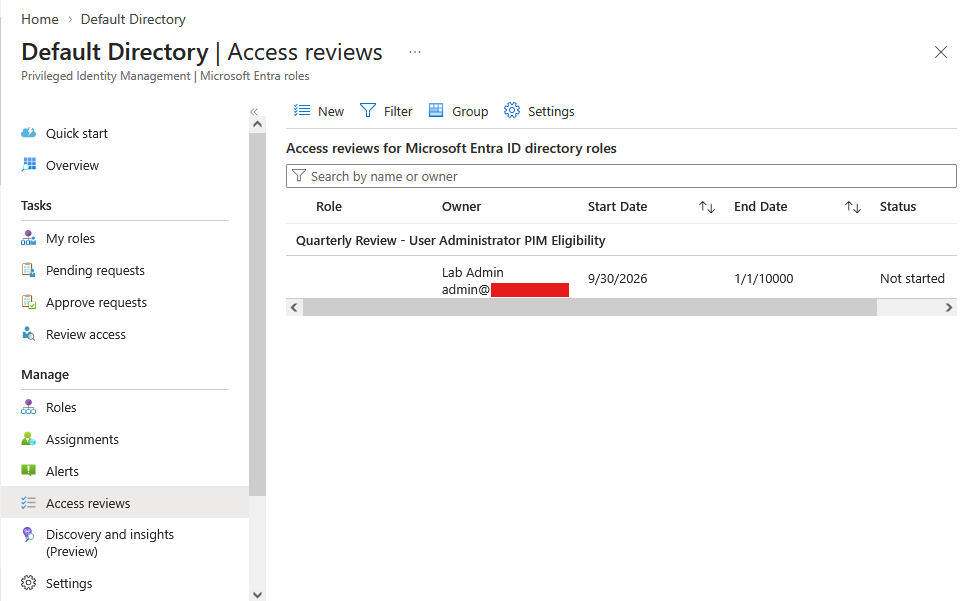

---

## 11. Phase 6 — Monitoring & Detection

### 11.1 Sign-in logs

To confirm the Conditional Access policies were actually being evaluated at sign-in time (not just configured), a test user's sign-in event was opened in the Sign-in logs and inspected via its Conditional Access tab. This confirmed CA01 applied successfully (MFA satisfied) while CA02 correctly did not apply, since the sign-in wasn't from a legacy client — exactly the outcome expected from two policies targeting different conditions.

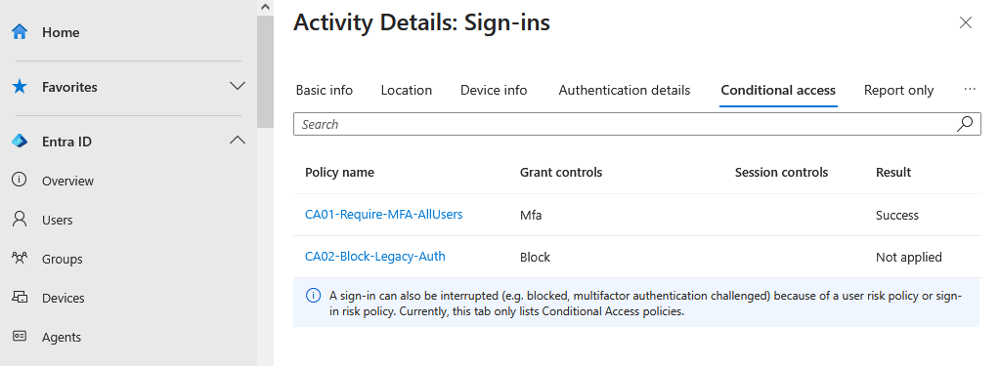

### 11.2 Audit logs

The Audit logs provide a directory-wide record of administrative actions. Here, the PIM role activation from Phase 4 was located and inspected in detail — showing the activation event, its "success" status, the actor who requested it, and the justification text they entered, all timestamped for traceability.

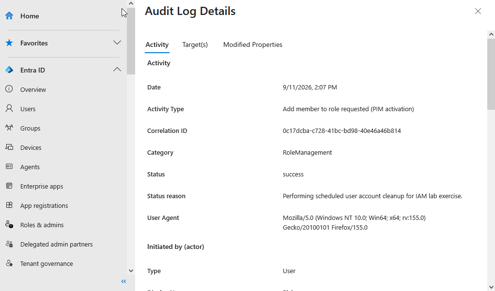

### 11.3 Identity Protection risk detections

Identity Protection's risk engine evaluates sign-ins and user behaviour against Microsoft's global threat intelligence, looking for signals such as impossible travel, sign-ins from anonymized IP addresses (e.g. Tor), atypical travel patterns, malware-linked IP addresses, leaked credential matches, and unfamiliar sign-in properties compared to a user's established baseline. Both the Risky sign-ins and Risk detections dashboards were reviewed — covering sign-in-linked risk and standalone user risk detections separately — and both returned no results, which is the expected outcome here: the tenant is only a few weeks old, has a small number of test accounts with no established behavioural baseline, and none of the test sign-ins (performed from a single known location/device) matched any threat intelligence indicators. In a production environment with real user populations and longer sign-in history, a genuine anomaly — such as a sign-in from an unfamiliar country shortly after one from Australia — would appear here with an assigned risk level (Low/Medium/High), a detection type (e.g. "Atypical travel" or "Anonymous IP address"), and could trigger an automatic remediation action (MFA challenge, block, or forced password reset) if a risk-based Conditional Access policy were configured.

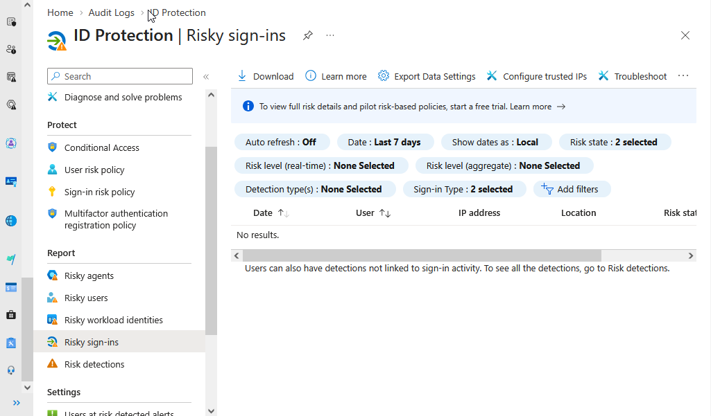

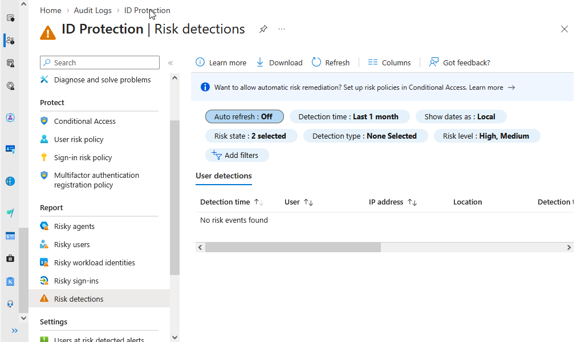

---

## 12. Findings & Detection Summary

| Control | Objective | Result | Evidence Ref |
|---|---|---|---|
| Hybrid Sync (PHS) | Unify on-prem and cloud identity | On-prem users synced successfully | Screenshots 3–6 |
| CA01 — Require MFA | Prevent password-only compromise | MFA enforced on all sign-ins | Screenshots 7, 11–12 |
| CA02 — Block Legacy Auth | Close a common bypass for MFA | Legacy protocol sign-ins blocked | Screenshot 8 |
| CA03 — Block Outside Trusted Location | Restrict admin access to known network | Sign-ins outside trusted IP blocked | Screenshots 9–10 |
| PIM JIT Elevation | Remove standing admin privilege | Role active only during approved window | Screenshots 13–15 |
| Access Review | Periodic recertification of access | Review scheduled against privileged role | Screenshot 16 |
| Sign-in / Audit Monitoring | Visibility into identity events | CA and PIM events traceable in logs | Screenshots 17–18 |
| Identity Protection | Detect anomalous sign-in behaviour | No detections (expected for a new, low-volume tenant) | Screenshots 19–20 |

---

## 13. Challenges & Troubleshooting

| Symptom | Root Cause | Fix |
|---|---|---|
| Named location IP entry rejected with "Value must be a valid IPv4 or IPv6 range" | Entered a bare IP address instead of CIDR notation | Appended `/32` to specify the exact single address, which the Named locations blade requires for any IP entry, even a single host |
| What If tool returned "Device platform required" despite the field appearing optional | Device platform and Client app are hard requirements for the tool to evaluate a simulated sign-in, even though they sit below several genuinely optional fields (User risk, Sign-in risk) | Selected a Device platform (Windows) and Client app before re-running the simulation |
| What If tool rejected a Country selection with "If using an IP address or Country, both fields will be required and should correctly map together" | Selected a Country (e.g. Afghanistan) without a matching IP address, so the simulated location had no consistent geolocation to evaluate against | Entered a real IP address that genuinely resolves to the selected country (e.g. `8.8.8.8` for United States) so the two fields correctly corresponded |
| Searching "Privileged Identity Management" in the global search bar led to the Azure resources (subscriptions/management groups) view instead of Microsoft Entra roles | The Entra admin center's global search returns multiple near-identical "Privileged Identity Management" entries, and the default one lands on the Azure resource-scoped experience rather than the directory-role one | Navigated via Identity Governance > Privileged Identity Management in the left-hand menu instead of global search, which correctly exposed the Microsoft Entra roles tasks (My roles, Pending requests, etc.) |
| The general Identity Governance > Access reviews > New access review flow only offered "Teams + Groups" and "Applications" as review types, with no option to scope to an Entra ID role | Directory role-scoped access reviews are created from within PIM's own Microsoft Entra roles blade, not from the standalone Access reviews service, despite both existing in the tenant | Created the review from Identity Governance > Privileged Identity Management > Microsoft Entra roles > Access reviews > New, which exposed the Role and Assignment type (Eligible/Active) scoping options directly |
| Newly created access review didn't appear in the Access reviews list immediately after clicking Start | UI/list caching delay after creation | Refreshed the page, after which the review appeared correctly with its configured schedule and status ("Not started") |
| Manually removing an active PIM role assignment early (rather than letting it expire naturally) didn't produce an entry under the "Expired assignments" tab | "Expired assignments" only tracks assignments that reached their natural time-based expiry, not ones ended via a manual "Remove" action | Located the event instead in Identity Governance > Privileged Identity Management > Microsoft Entra roles > Audit logs, which correctly logged both the "Add member to role" (activation) and "Remove member from role" (manual deactivation) events with timestamps and actor |
| Individual MCA billing accounts are ineligible for the standalone Entra ID P2 trial | Microsoft restricts the standalone P2 trial for accounts on an individual Microsoft Customer Agreement billing profile | Worked around via the bundled Microsoft 365 E5 trial, which includes P2 features and is not subject to the same restriction |

---

## 14. Conclusion

This lab demonstrates an end-to-end hybrid identity security posture: synchronizing on-prem AD to the cloud, enforcing conditional, risk-aware access, replacing standing privileged access with just-in-time elevation, and validating all of it through sign-in and audit log monitoring. Together these map directly to real IAM engineer, identity security analyst, and SOC analyst responsibilities — and build on the AD, Wazuh, and detection engineering work already completed in the broader homelab portfolio.

### Suggested next steps

- Pair this lab with the SC-300 (Identity and Access Administrator) certification study path.
- Extend monitoring by forwarding Entra ID sign-in/audit logs to the existing Wazuh SIEM via the Microsoft Graph API or a log connector, for a unified detection view across on-prem and cloud.
- Add Entra ID Governance entitlement management (access packages) as a follow-up PAM project.

---

## Appendix A — Useful PowerShell / CLI Reference

```powershell
# Check Entra Connect sync service
Get-Service -Name ADSync

# Force a delta sync cycle
Start-ADSyncSyncCycle -PolicyType Delta

# Force a full initial sync cycle
Start-ADSyncSyncCycle -PolicyType Initial

# View sync scheduler status
Get-ADSyncScheduler
```

---

## Appendix B — Repository Structure

```
Entra-Hybrid-Identity-PAM-Lab/
├── README.md
└── screenshots/
    ├── 01-architecture-diagram.png
    ├── 02-tenant-overview.png
    ├── 03-p2-license-trial.png
    ├── 04-connect-sync-wizard.png
    ├── 05-adsync-service-status.png
    ├── 06-users-synced.png
    ├── 07-ca01-mfa-policy.png
    ├── 08-ca02-legacy-auth-whatif.png
    ├── 09-ca03-named-location.png
    ├── 10-ca03-whatif-result.png
    ├── 11-mfa-registration.png
    ├── 12-mfa-challenge.png
    ├── 13-pim-eligible-assignment.png
    ├── 14-pim-activation-request.png
    ├── 15-pim-audit-history.png
    ├── 16-access-review-config.png
    ├── 17-signin-log-ca-tab.png
    ├── 18-audit-log-pim-activation.png
    ├── 19-identity-protection-risky-signins.png
    └── 20-identity-protection-risk-detections.png
```
